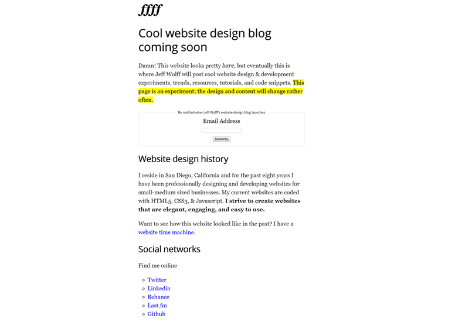
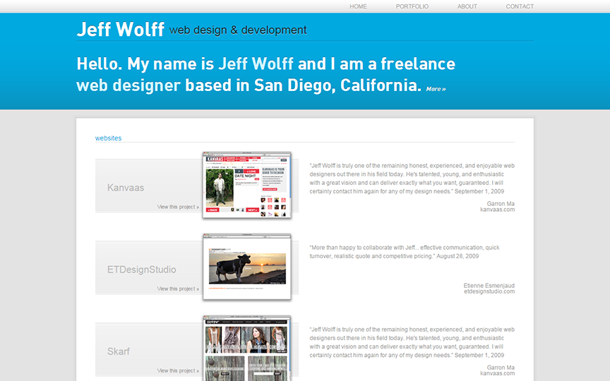

Here are the past versions of my website:
* 

    <a href="http://jeff-wolff.github.io/" target="_blank">Hiatus (2015-2019)</a>
  

  <figure>
      
  </figure>
* 

    <a href="http://jeff-wolff.github.io/v3" target="_blank">Version 3 (2012-2015)</a>
  

  <figure>
      
  </figure>
* 

    <a href="http://jeff-wolff.github.io/v2" target="_blank">Version 2 (2009-2012)</a>
  

  <figure>
      
  </figure>
* 

    <a href="http://jeff-wolff.github.io/v1" target="_blank">Version 1 (circa 2009)</a>
  

  <figure>
      
  </figure>

